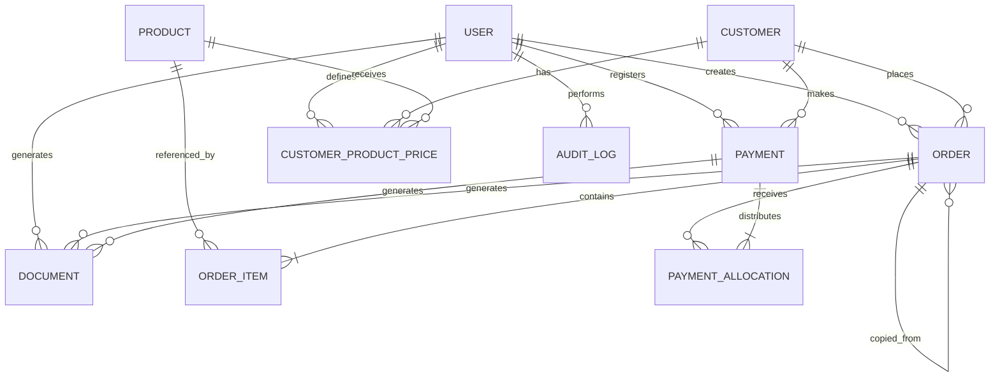

# Pane Facile — Estrutura do Banco de Dados e Relacionamentos do MVP

## 1. Objetivo

Este documento apresenta a estrutura relacional do banco de dados do MVP do Pane Facile.

A modelagem foi pensada para PostgreSQL com Prisma ORM e cobre apenas:

- usuários administradores;
- clientes;
- produtos;
- preços personalizados;
- pedidos;
- itens de pedido;
- pagamentos;
- distribuição de pagamentos;
- documentos;
- auditoria mínima.

---

# 2. Visão geral do modelo

```text
User
 ├── cria pedidos
 ├── confirma pedidos
 ├── cancela pedidos
 ├── registra pagamentos
 ├── cancela pagamentos
 └── gera documentos

Customer
 ├── possui pedidos
 ├── possui pagamentos
 └── possui preços personalizados

Product
 ├── participa de itens de pedido
 └── possui preços personalizados

Order
 ├── possui itens
 ├── recebe alocações de pagamento
 ├── pode originar outro pedido repetido
 └── pode possuir comprovantes

Payment
 ├── pertence a um cliente
 ├── possui alocações
 └── pode possuir recibos
```

---

# 3. Diagrama entidade-relacionamento



---

# 4. Tabela users

## 4.1 Estrutura

| Coluna | Tipo PostgreSQL | Nulo | Restrições |
|---|---|---:|---|
| `id` | UUID | Não | PK |
| `name` | VARCHAR(120) | Não |  |
| `email` | VARCHAR(255) | Não | UNIQUE |
| `password_hash` | VARCHAR(255) | Não |  |
| `role` | user_role | Não | DEFAULT `ADMIN` |
| `active` | BOOLEAN | Não | DEFAULT `true` |
| `last_login_at` | TIMESTAMPTZ | Sim |  |
| `created_at` | TIMESTAMPTZ | Não | DEFAULT `now()` |
| `updated_at` | TIMESTAMPTZ | Não |  |

## 4.2 Índices

```text
UNIQUE(email)
INDEX(active)
```

---

# 5. Tabela customers

## 5.1 Estrutura

| Coluna | Tipo PostgreSQL | Nulo | Restrições |
|---|---|---:|---|
| `id` | UUID | Não | PK |
| `trade_name` | VARCHAR(160) | Não |  |
| `legal_name` | VARCHAR(200) | Sim |  |
| `document` | VARCHAR(20) | Sim |  |
| `contact_name` | VARCHAR(120) | Sim |  |
| `phone` | VARCHAR(30) | Não |  |
| `email` | VARCHAR(255) | Sim |  |
| `address_line` | VARCHAR(255) | Sim |  |
| `district` | VARCHAR(120) | Sim |  |
| `city` | VARCHAR(120) | Sim |  |
| `state` | VARCHAR(2) | Sim |  |
| `postal_code` | VARCHAR(12) | Sim |  |
| `credit_limit` | NUMERIC(12,2) | Sim | CHECK `>= 0` |
| `notes` | TEXT | Sim |  |
| `active` | BOOLEAN | Não | DEFAULT `true` |
| `created_at` | TIMESTAMPTZ | Não | DEFAULT `now()` |
| `updated_at` | TIMESTAMPTZ | Não |  |
| `deleted_at` | TIMESTAMPTZ | Sim |  |

## 5.2 Índices

```text
INDEX(trade_name)
INDEX(phone)
INDEX(document)
INDEX(active, deleted_at)
```

## 5.3 Observação

O documento pode receber restrição `UNIQUE` futuramente, mas no MVP isso deve ser decidido após validar se o cliente possui cadastros sem CNPJ ou com documentos compartilhados.

---

# 6. Tabela products

## 6.1 Estrutura

| Coluna | Tipo PostgreSQL | Nulo | Restrições |
|---|---|---:|---|
| `id` | UUID | Não | PK |
| `name` | VARCHAR(160) | Não |  |
| `description` | TEXT | Sim |  |
| `unit` | product_unit | Não |  |
| `default_price` | NUMERIC(12,2) | Não | CHECK `>= 0` |
| `minimum_price` | NUMERIC(12,2) | Não | CHECK `>= 0` |
| `image_url` | TEXT | Sim |  |
| `notes` | TEXT | Sim |  |
| `active` | BOOLEAN | Não | DEFAULT `true` |
| `created_at` | TIMESTAMPTZ | Não | DEFAULT `now()` |
| `updated_at` | TIMESTAMPTZ | Não |  |
| `deleted_at` | TIMESTAMPTZ | Sim |  |

## 6.2 Restrições

```text
CHECK(default_price >= minimum_price)
```

Caso o negócio permita preço padrão abaixo do mínimo em situações excepcionais, essa restrição deve ser removida e tratada na aplicação.

## 6.3 Índices

```text
INDEX(name)
INDEX(active, deleted_at)
```

---

# 7. Tabela customer_product_prices

## 7.1 Estrutura

| Coluna | Tipo PostgreSQL | Nulo | Restrições |
|---|---|---:|---|
| `id` | UUID | Não | PK |
| `customer_id` | UUID | Não | FK → customers.id |
| `product_id` | UUID | Não | FK → products.id |
| `price` | NUMERIC(12,2) | Não | CHECK `>= 0` |
| `below_minimum_reason` | TEXT | Sim |  |
| `created_by_id` | UUID | Não | FK → users.id |
| `created_at` | TIMESTAMPTZ | Não | DEFAULT `now()` |
| `updated_at` | TIMESTAMPTZ | Não |  |
| `deleted_at` | TIMESTAMPTZ | Sim |  |

## 7.2 Relacionamentos

```text
customers 1 ─── N customer_product_prices
products  1 ─── N customer_product_prices
users     1 ─── N customer_product_prices
```

## 7.3 Unicidade

No Prisma, uma restrição simples pode ser:

```text
UNIQUE(customer_id, product_id)
```

Porém, como há soft delete, existem duas opções:

### Opção A — recomendada para o MVP

Não permitir múltiplos registros históricos.

Ao remover o preço:

- preencher `deleted_at`;
- ao recriar, restaurar e atualizar o mesmo registro.

### Opção B — índice parcial PostgreSQL

```sql
CREATE UNIQUE INDEX uq_active_customer_product_price
ON customer_product_prices(customer_id, product_id)
WHERE deleted_at IS NULL;
```

A opção B exige migração SQL customizada.

---

# 8. Tabela orders

## 8.1 Estrutura

| Coluna | Tipo PostgreSQL | Nulo | Restrições |
|---|---|---:|---|
| `id` | UUID | Não | PK |
| `number` | VARCHAR(30) | Não | UNIQUE |
| `customer_id` | UUID | Não | FK → customers.id |
| `status` | order_status | Não | DEFAULT `DRAFT` |
| `delivery_date` | TIMESTAMPTZ | Não |  |
| `due_date` | TIMESTAMPTZ | Sim |  |
| `subtotal` | NUMERIC(12,2) | Não | CHECK `>= 0` |
| `discount` | NUMERIC(12,2) | Não | DEFAULT `0`, CHECK `>= 0` |
| `total` | NUMERIC(12,2) | Não | CHECK `>= 0` |
| `notes` | TEXT | Sim |  |
| `created_by_id` | UUID | Não | FK → users.id |
| `confirmed_by_id` | UUID | Sim | FK → users.id |
| `confirmed_at` | TIMESTAMPTZ | Sim |  |
| `canceled_by_id` | UUID | Sim | FK → users.id |
| `canceled_at` | TIMESTAMPTZ | Sim |  |
| `cancel_reason` | TEXT | Sim |  |
| `source_order_id` | UUID | Sim | FK → orders.id |
| `created_at` | TIMESTAMPTZ | Não | DEFAULT `now()` |
| `updated_at` | TIMESTAMPTZ | Não |  |
| `deleted_at` | TIMESTAMPTZ | Sim |  |

## 8.2 Relacionamentos

```text
customers 1 ─── N orders
users     1 ─── N orders
orders    1 ─── N orders, por source_order_id
```

## 8.3 Índices

```text
UNIQUE(number)
INDEX(customer_id, created_at)
INDEX(status)
INDEX(delivery_date)
INDEX(due_date)
INDEX(deleted_at)
INDEX(source_order_id)
```

## 8.4 Regras de consistência

```text
total = subtotal - discount
discount <= subtotal
```

Essas regras devem ser validadas no backend.

Podem também ser reforçadas com `CHECK`.

---

# 9. Tabela order_items

## 9.1 Estrutura

| Coluna | Tipo PostgreSQL | Nulo | Restrições |
|---|---|---:|---|
| `id` | UUID | Não | PK |
| `order_id` | UUID | Não | FK → orders.id |
| `product_id` | UUID | Não | FK → products.id |
| `product_name` | VARCHAR(160) | Não | Snapshot |
| `unit` | product_unit | Não | Snapshot |
| `quantity` | NUMERIC(12,3) | Não | CHECK `> 0` |
| `unit_price` | NUMERIC(12,2) | Não | CHECK `>= 0` |
| `subtotal` | NUMERIC(12,2) | Não | CHECK `>= 0` |
| `original_unit_price` | NUMERIC(12,2) | Sim |  |
| `below_minimum_reason` | TEXT | Sim |  |
| `notes` | TEXT | Sim |  |
| `created_at` | TIMESTAMPTZ | Não | DEFAULT `now()` |
| `updated_at` | TIMESTAMPTZ | Não |  |

## 9.2 Relacionamentos

```text
orders   1 ─── N order_items
products 1 ─── N order_items
```

## 9.3 Exclusão

Itens não devem possuir soft delete no MVP.

Quando o pedido estiver em rascunho, itens podem ser removidos fisicamente.

Depois da confirmação, os itens devem ser tratados como histórico imutável.

## 9.4 Índices

```text
INDEX(order_id)
INDEX(product_id)
```

---

# 10. Tabela payments

## 10.1 Estrutura

| Coluna | Tipo PostgreSQL | Nulo | Restrições |
|---|---|---:|---|
| `id` | UUID | Não | PK |
| `number` | VARCHAR(30) | Não | UNIQUE |
| `customer_id` | UUID | Não | FK → customers.id |
| `amount` | NUMERIC(12,2) | Não | CHECK `> 0` |
| `payment_method` | payment_method | Não |  |
| `paid_at` | TIMESTAMPTZ | Não |  |
| `notes` | TEXT | Sim |  |
| `created_by_id` | UUID | Não | FK → users.id |
| `canceled_by_id` | UUID | Sim | FK → users.id |
| `canceled_at` | TIMESTAMPTZ | Sim |  |
| `cancel_reason` | TEXT | Sim |  |
| `created_at` | TIMESTAMPTZ | Não | DEFAULT `now()` |
| `updated_at` | TIMESTAMPTZ | Não |  |

## 10.2 Relacionamentos

```text
customers 1 ─── N payments
users     1 ─── N payments
```

## 10.3 Índices

```text
UNIQUE(number)
INDEX(customer_id, paid_at)
INDEX(payment_method)
INDEX(canceled_at)
```

## 10.4 Observação

Não deve existir `order_id` direto em `payments`.

A relação com pedidos é feita por `payment_allocations`.

Isso permite pagamentos gerais do cliente.

---

# 11. Tabela payment_allocations

## 11.1 Estrutura

| Coluna | Tipo PostgreSQL | Nulo | Restrições |
|---|---|---:|---|
| `id` | UUID | Não | PK |
| `payment_id` | UUID | Não | FK → payments.id |
| `order_id` | UUID | Não | FK → orders.id |
| `amount` | NUMERIC(12,2) | Não | CHECK `> 0` |
| `created_at` | TIMESTAMPTZ | Não | DEFAULT `now()` |

## 11.2 Relacionamentos

```text
payments 1 ─── N payment_allocations
orders   1 ─── N payment_allocations
```

## 11.3 Unicidade recomendada

```text
UNIQUE(payment_id, order_id)
```

No MVP, cada pagamento deve possuir no máximo uma alocação por pedido.

Se o usuário editar a distribuição, o registro existente deve ser atualizado.

## 11.4 Índices

```text
INDEX(payment_id)
INDEX(order_id)
UNIQUE(payment_id, order_id)
```

## 11.5 Regras transacionais

Na criação ou edição:

1. validar se pagamento e pedido pertencem ao mesmo cliente;
2. bloquear pagamentos cancelados;
3. bloquear pedidos cancelados;
4. calcular saldo atual do pedido;
5. impedir alocação superior ao saldo;
6. impedir que a soma das alocações supere o pagamento;
7. persistir tudo dentro da mesma transação.

---

# 12. Tabela documents

## 12.1 Estrutura opcional

| Coluna | Tipo PostgreSQL | Nulo | Restrições |
|---|---|---:|---|
| `id` | UUID | Não | PK |
| `number` | VARCHAR(30) | Não | UNIQUE |
| `type` | document_type | Não |  |
| `order_id` | UUID | Sim | FK → orders.id |
| `payment_id` | UUID | Sim | FK → payments.id |
| `file_url` | TEXT | Sim |  |
| `mime_type` | VARCHAR(100) | Sim |  |
| `generated_by_id` | UUID | Não | FK → users.id |
| `generated_at` | TIMESTAMPTZ | Não | DEFAULT `now()` |
| `invalidated_at` | TIMESTAMPTZ | Sim |  |
| `created_at` | TIMESTAMPTZ | Não | DEFAULT `now()` |

## 12.2 Restrições de domínio

- `ORDER_RECEIPT` exige `order_id`;
- `PAYMENT_RECEIPT` exige `payment_id`;
- um documento não deve apontar simultaneamente para pedido e pagamento, salvo decisão explícita.

## 12.3 Estratégia simplificada

Se o documento for sempre gerado sob demanda, esta tabela pode ser omitida inicialmente.

Nesse caso:

- o número do pedido vem de `orders.number`;
- o número do recibo vem de `payments.number`;
- imagem e PDF são gerados dinamicamente.

---

# 13. Tabela audit_logs

## 13.1 Estrutura recomendada

| Coluna | Tipo PostgreSQL | Nulo | Restrições |
|---|---|---:|---|
| `id` | UUID | Não | PK |
| `user_id` | UUID | Não | FK → users.id |
| `action` | audit_action | Não |  |
| `entity_type` | VARCHAR(100) | Não |  |
| `entity_id` | UUID | Não |  |
| `metadata` | JSONB | Sim |  |
| `created_at` | TIMESTAMPTZ | Não | DEFAULT `now()` |

## 13.2 Índices

```text
INDEX(user_id, created_at)
INDEX(entity_type, entity_id)
INDEX(action)
```

## 13.3 Política

Logs de auditoria são append-only.

Não devem ser atualizados ou excluídos pela aplicação.

---

# 14. Enums do banco

## user_role

```text
ADMIN
```

## product_unit

```text
UNIT
KG
PACKAGE
BOX
DOZEN
```

## order_status

```text
DRAFT
CONFIRMED
IN_PRODUCTION
READY
DELIVERED
CANCELED
```

## payment_method

```text
CASH
PIX
BANK_TRANSFER
CREDIT
OTHER
```

## document_type

```text
ORDER_RECEIPT
PAYMENT_RECEIPT
```

## audit_action

```text
ORDER_CONFIRMED
ORDER_CANCELED
BELOW_MINIMUM_PRICE_USED
PAYMENT_CREATED
PAYMENT_CANCELED
PAYMENT_REALLOCATED
ENTITY_SOFT_DELETED
```

---

# 15. Relacionamentos detalhados

## 15.1 Customer → Order

```text
Customer 1:N Order
```

Um cliente pode possuir vários pedidos.

Um pedido pertence a apenas um cliente.

### Exclusão

Não usar `CASCADE DELETE`.

Cliente excluído logicamente deve continuar referenciado.

---

## 15.2 Order → OrderItem

```text
Order 1:N OrderItem
```

Um pedido possui um ou mais itens.

Um item pertence a apenas um pedido.

### Exclusão

- em rascunho: remoção física permitida;
- confirmado: itens devem ser preservados;
- exclusão física do pedido não deve ocorrer no fluxo normal.

---

## 15.3 Product → OrderItem

```text
Product 1:N OrderItem
```

Um produto pode aparecer em vários itens.

Um item referencia um produto e mantém snapshot.

### Exclusão

Não usar `CASCADE DELETE`.

Produto excluído logicamente deve continuar referenciado.

---

## 15.4 Customer ↔ Product por CustomerProductPrice

```text
Customer N:N Product
```

A relação é materializada por `customer_product_prices`.

Ela armazena o atributo adicional `price`.

---

## 15.5 Customer → Payment

```text
Customer 1:N Payment
```

Um cliente pode realizar vários pagamentos.

Cada pagamento pertence a um cliente.

---

## 15.6 Payment ↔ Order por PaymentAllocation

```text
Payment N:N Order
```

A relação é materializada por `payment_allocations`.

Ela armazena o atributo adicional `amount`.

Essa estrutura é necessária para:

- pagamento parcial;
- pagamento de vários pedidos;
- vários pagamentos no mesmo pedido;
- quitação do débito total do cliente.

---

## 15.7 Order → Order por sourceOrderId

```text
Order 1:N Order
```

Um pedido pode servir como origem de vários pedidos repetidos.

Um pedido repetido possui no máximo um pedido de origem.

---

# 16. Regras de deleção

## 16.1 Soft delete

Aplicar em:

```text
customers
products
customer_product_prices
orders, apenas quando permitido
```

## 16.2 Sem exclusão física no fluxo normal

Não excluir fisicamente:

```text
payments
payment_allocations
audit_logs
documentos financeiros emitidos
pedidos confirmados
```

## 16.3 Estratégia de Foreign Key

Recomendação:

```text
ON DELETE RESTRICT
```

ou

```text
ON DELETE NO ACTION
```

Evitar `CASCADE` nas entidades históricas.

---

# 17. Cálculos financeiros

## 17.1 Total recebido do pedido

```sql
SELECT COALESCE(SUM(pa.amount), 0)
FROM payment_allocations pa
JOIN payments p ON p.id = pa.payment_id
WHERE pa.order_id = :orderId
  AND p.canceled_at IS NULL;
```

## 17.2 Saldo do pedido

```text
remainingBalance = order.total - receivedAmount
```

## 17.3 Total em aberto do cliente

Soma dos saldos de pedidos:

- não cancelados;
- não excluídos;
- com saldo maior que zero.

## 17.4 Total vencido

Soma dos saldos dos pedidos:

- não cancelados;
- `due_date < now`;
- saldo maior que zero.

---

# 18. Transações obrigatórias

## 18.1 Criar pedido

A transação deve incluir:

- criação do pedido;
- criação dos itens;
- cálculo dos totais;
- auditoria, se aplicável.

## 18.2 Confirmar pedido

A transação deve incluir:

- validação dos itens;
- atualização do status;
- datas de confirmação;
- auditoria.

## 18.3 Registrar pagamento

A transação deve incluir:

- criação de `payment`;
- criação das alocações;
- validações de saldo;
- auditoria.

## 18.4 Cancelar pagamento

A transação deve incluir:

- atualização do pagamento;
- invalidação das alocações;
- auditoria.

## 18.5 Redistribuir pagamento

A transação deve incluir:

- validação do valor total;
- remoção ou atualização das alocações;
- criação das novas alocações;
- auditoria.

---

# 19. Índices mínimos recomendados

```text
users.email

customers.trade_name
customers.phone
customers.document
customers.active + customers.deleted_at

products.name
products.active + products.deleted_at

customer_product_prices.customer_id + product_id

orders.number
orders.customer_id + created_at
orders.status
orders.delivery_date
orders.due_date
orders.source_order_id

order_items.order_id
order_items.product_id

payments.number
payments.customer_id + paid_at
payments.payment_method
payments.canceled_at

payment_allocations.payment_id
payment_allocations.order_id
payment_allocations.payment_id + order_id

audit_logs.entity_type + entity_id
audit_logs.user_id + created_at
```

---

# 20. Estrutura Prisma conceitual

O schema final pode seguir esta organização:

```text
model User
model Customer
model Product
model CustomerProductPrice
model Order
model OrderItem
model Payment
model PaymentAllocation
model Document
model AuditLog
```

A implementação deve usar:

- `@id @default(uuid())`;
- `Decimal`;
- `@db.Decimal(12, 2)`;
- `DateTime`;
- `@@index`;
- `@@unique`;
- nomes de tabelas com `@@map`, se desejado;
- nomes de colunas com `@map`, se desejado.

---

# 21. Decisões pendentes antes do schema definitivo

1. CPF/CNPJ deve ser único?
2. O endereço será armazenado em campos separados ou em um único campo?
3. Quantidades podem ter casas decimais?
4. Quais unidades realmente são usadas?
5. `creditLimit` será apenas informativo ou bloqueará pedidos?
6. Documentos serão persistidos ou gerados sob demanda?
7. O preço padrão pode ficar abaixo do preço mínimo?
8. O pedido pode ser editado depois de confirmado?
9. O cancelamento de pedido pago exige cancelamento prévio dos pagamentos?
10. O desconto será apenas global ou também por item?
11. Deve existir histórico de mudança de status?
12. Deve existir índice parcial para preços personalizados ativos?

---

# 22. Estrutura mínima para o primeiro release

## Obrigatórias

```text
users
customers
products
customer_product_prices
orders
order_items
payments
payment_allocations
```

## Recomendadas

```text
audit_logs
```

## Opcionais

```text
documents
```

A tabela `documents` pode ser adiada caso comprovantes e recibos sejam gerados dinamicamente sem armazenamento permanente.
